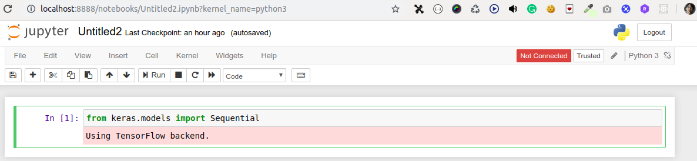

# Deep Learning

## Install dependencies
```
$ sudo apt update
$ sudo apt install python3-dev python3-pip
$ 
# Current stable release for CPU-only
$ sudo pip3 install tensorflow
$
$ sudo pip3 install keras
$ 
$ pip3 install jupyter
$ jupyter notebook
$
$ pip3 install numpy scipy matplotlib ipython pandas sympy nose scikit-learn
```

## Try keras from python terminal -  
```
$ python3
Python 3.5.2 (default, Nov 12 2018, 13:43:14) 
[GCC 5.4.0 20160609] on linux
Type "help", "copyright", "credits" or "license" for more information.
>>> from keras.models import Sequential
Using TensorFlow backend.
>>>
```

## Or, in jupyter notebook


## Checking TensorFlow version
```
$ pip3 list | grep tensorflow
/usr/local/lib/python3.5/dist-packages/pip/_vendor/requests/__init__.py:83: RequestsDependencyWarning: Old version of cryptography ([1, 2, 3]) may cause slowdown.
  warnings.warn(warning, RequestsDependencyWarning)
tensorflow                    1.13.1                
tensorflow-estimator          1.13.0
$
```

Or,
```
$ pip3 show tensorflow
/usr/local/lib/python3.5/dist-packages/pip/_vendor/requests/__init__.py:83: RequestsDependencyWarning: Old version of cryptography ([1, 2, 3]) may cause slowdown.
  warnings.warn(warning, RequestsDependencyWarning)
Name: tensorflow
Version: 1.13.1
Summary: TensorFlow is an open source machine learning framework for everyone.
Home-page: https://www.tensorflow.org/
Author: Google Inc.
Author-email: opensource@google.com
License: Apache 2.0
Location: /usr/local/lib/python3.5/dist-packages
Requires: wheel, termcolor, tensorflow-estimator, protobuf, gast, absl-py, six, tensorboard, grpcio, astor, keras-preprocessing, keras-applications, numpy
Required-by:
```

Or,
```
$ python3
Python 3.5.2 (default, Nov 12 2018, 13:43:14) 
[GCC 5.4.0 20160609] on linux
Type "help", "copyright", "credits" or "license" for more information.
>>> import tensorflow
>>> tensorflow.__version__
'1.13.1'
>>>
```
## Projects

* [deep learning with python](https://github.com/shahjalalh/deeplearning/tree/master/deep-learning-with-python)
* [deep learning a to z](https://github.com/shahjalalh/deeplearning/tree/master/deep-learning-a-z)
